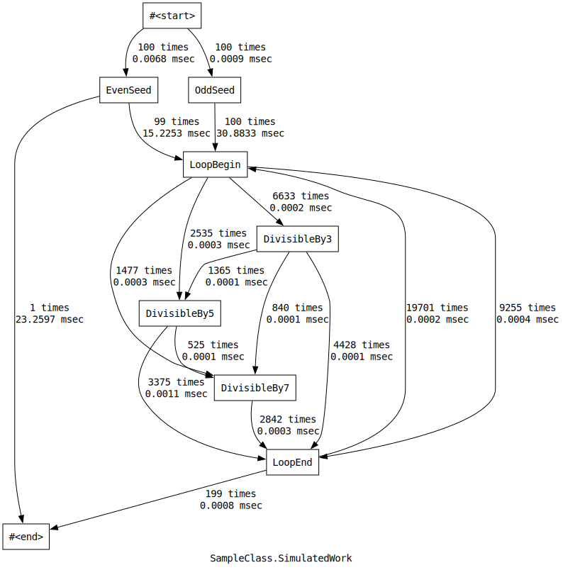

# PathBench

Code path performance monitoring tool.

----

## Features

*PathBench* is a tool that measures method execution time to identify performance bottlenecks. It provides the following features:

- **Method execution time statistics**: Measures method execution times and provides statistical information such as the mean, standard deviation, minimum, and maximum.
- **Checkpoint recording**: Allows you to set checkpoints at arbitrary locations within a method and measure the execution time between checkpoints.
- **Result visualization**: Outputs measurement results in Graphviz format and visualizes them as a directed graph between checkpoints.

## Usage

1. **Installation**: Add *PathBench* to your project from NuGet.
2. **Code changes**
    1. Create a `CodePathCounter` instance in the class that contains the method you want to monitor.
    2. At the beginning of the monitored method, call `counter.StartMeasurement()` to create a measurement instance and start the measurement.
    3. Dispose the measurement instance to end the measurement.
    4. Call the `CreateProfileReports()` method on the `CodePathCounter` instance to produce measurement report instances.
    5. Pass the measurement report instances to an appropriate formatter to output the results.

```csharp
using PathBench;

invokeTest();

static void invokeTest()
{
    for (var i = 0; i < 1000; ++i)
    {
        SampleClass.SimulatedWork(i);
    }

    var reports = SampleClass.Profiler.CreateProfileReports();
    var sw = new StringWriter();
    MethodProfileReportFormatter.DefaultGraphvizStyle.Format(
        reports[nameof(SampleClass.SimulatedWork)],
        writer: sw);
    Console.WriteLine(sw.ToString());
}

static class SampleClass
{
    public static readonly CodePathProfiler Profiler = CodePathProfiler.Create();

    public static void SimulatedWork(int seed)
    {
        using var counter = Profiler.StartMeasurement(argumentsExpressionProvider: $"seed={seed}");
        if (seed % 2 == 0)
        {
            counter.MarkCheckpoint("EvenSeed");
            Wait(2);
        }
        else
        {
            counter.MarkCheckpoint("OddSeed");
            Wait(0);
        }
        for (var i = 0; i < seed; ++i)
        {
            counter.MarkCheckpoint("LoopBegin", i);
            if (seed % 3 == 0)
            {
                counter.MarkCheckpoint("DivisibleBy3");
                Wait(3);
            }
            if (seed % 5 == 0)
            {
                counter.MarkCheckpoint("DivisibleBy5");
                Wait(5);
            }
            if (seed % 7 == 0)
            {
                counter.MarkCheckpoint("DivisibleBy7");
                Wait(7);
            }
            counter.MarkCheckpoint("LoopEnd");
        }
    }

    private static void Wait(int value)
    {
        Thread.SpinWait(value * 100);
    }
}
```


